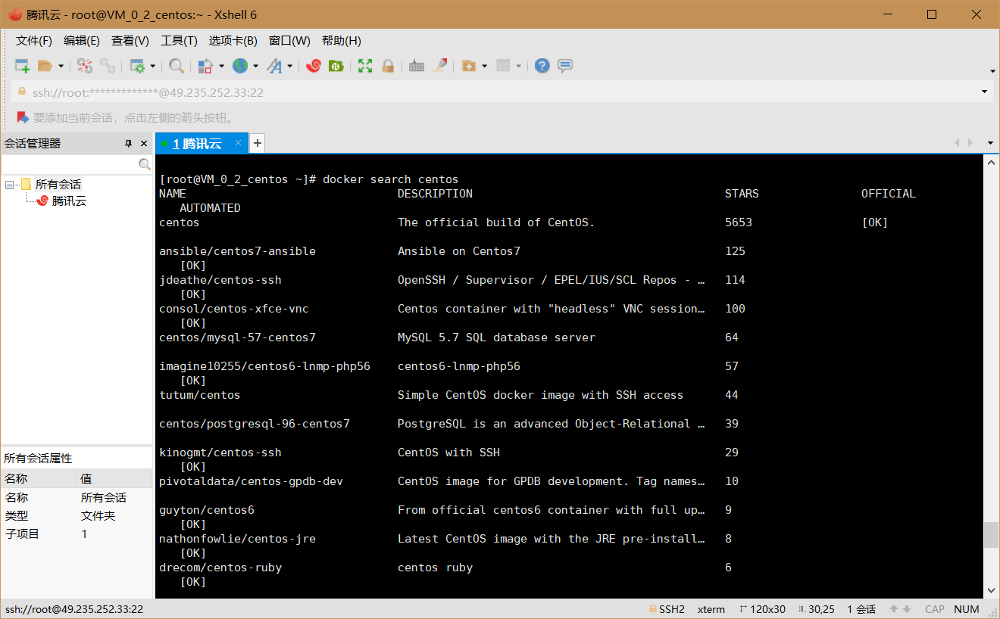
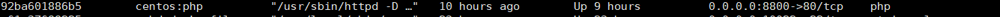
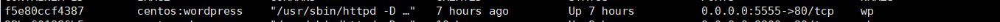

# Docker

## 先决条件

- 已安装CentOS 7，并且内核版本大等于3.10，本文使用的是阿里云的镜像：[CentOS镜像](http://mirrors.aliyun.com/centos/7/isos/x86_64/)。
- 非root用户已获得sudo特权。

使用如下命令查看操作系统内核信息：

```使用如下命令查看操作系统内核信息：
uname -r
```


顺带看一下Linux的版本号：

```
cat /etc/redhat-release
```


## 安装Docker

CentOS 7的应用程序库可能不是最新的，因此首先更新应用程序数据库：

```
sudo yum check-update
```


安装curl


接下来添加Docker的官方仓库，下载最新的Docker并安装： 

```
curl -fsSL https://get.docker.com/ | sh
```


安装完成之后启动Docker守护进程，即Docker服务：

```
sudo systemctl start docker
```

验证Docker是否成功启动：

```
sudo systemctl status docker
```


最后，确保Docker当服务器启动时自启动： 

```
sudo systemctl enable docker
```

此外，还可以查看一下Docker的版本信息：

```
docker version
```


## Docker基本操作

### Docker的命令使用

查看docker所有的命令，键入： 

> docker


查看当前系统docker的相关信息： 

> docker info


### 加载Docker镜像

Docker镜像是容器运行的基础，默认情况下，将从Docker Hub拉取镜像。首先使用search命令查询Docker Hub中的可用镜像，这里以查询可用的CentOS镜像为例：

> docker search centos



接下来拉取官方版本(OFFICIAL)的镜像： 

> docker pull centos：7

一旦镜像下载完成，可以基于该镜像运行容器，使用run命令： 

> docker run centos

查看一下当前系统中存在的镜像： 

> docker images


### 运行Docker容器

**查看已启动的容器**

> docker ps

**进入容器前台（容器id可以只写前几位，如 ：53c）**

> docker exec -it 53c /bin/bash


## 创建新的镜像 

在前序操作的基础上，本小节将创建新的镜像，即提交更改到新的镜像。首先从容器的交互shell退出并保存状态，使用exit命令

> exit

我们首先使用如下命令查看本地中的容器： 

> docker ps -a

参数-a表示列出所有容器，包含活跃的和不活跃的。输出类似下图：


可以发现刚才运行的ID为00123e32a83c的容器也在列表之中。
 现在使用commit命令来提交更改到新的镜像中，即创建新的镜像。命令格式

> docker commit -m “install apache server” -a “ll” 5c1f2ad1e3a9 centos:apache_web

这种提交类似于git协议的提交，同样这里提交的镜像只保存在本地。后续可以提交到远程镜像仓库，比如Docker Hub。
 再次使用镜像查看命令： 

> docker images


可以看到刚才创建的新镜像“centos:apache_web”，并且从大小（SIZE）来看(346MB)，区别于我们原始从Docker Hub拉取的CentOS的官方镜像(202MB)。
接下来要为新建的镜像打上标签（Tag），否则后续推送镜像到Docker Hub的时候将出现“ denied: requested access to the resource is denied”的错误。关于这个错误的解答详见stackoverflow。
Tag命令的语法：

其中hub-username是Docker Hub的用户账户，这里采用如下命令：

> docker tag 80e5b16aaa5c docker-hub-username/centos:apache_web

docker-hub-username替换为Docker Hub的实际用户名。这里使用镜像ID来指代想要打标签的镜像。完成之后，同样查看已存在的镜像：

> docker images


### 容器中安装wordpress

## 1.安装Apache Web服务器 

使用yum工具安装： 

```
yum install httpd
```

sudo命令获得了root用户的执行权限，因此需要验证用户口令。
 安装完成之后，启动Apache Web服务器：

```
systemctl start httpd.service
```

测试Apache服务器是否成功运行，找到腾讯云实例的公有IP地址(your_cvm_ip)，在你本地主机的浏览器上输入：

```
http://your_cvm_ip/
```


### 安装MySQL

CentOS 7.2的yum源中并末包含MySQL，需要其他方式手动安装。因此，我们采用MySQL数据库的开源分支MariaDB作为替代。
 安装MariaDB：

```
 yum install mariadb-server mariadb
```

安装好之后，启动mariadb：

```
 systemctl start mariadb
```

随后，运行简单的安全脚本以移除潜在的安全风险，启动交互脚本：

```
 mysql_secure_installation
```

设置相应的root访问密码以及相关的设置(都选择Y)。
 最后设置开机启动MariaDB： 

```
systemctl enable mariadb.service
```

### 安装PHP

PHP 7.x包在许多仓库中都包含，这里我们使用Remi仓库，而Remi仓库依赖于EPEL仓库，因此首先启用这两个仓库 

```
 yum install epel-release yum-utils
 yum install http://rpms.remirepo.net/enterprise/remi-release-7.rpm
```

接着启用PHP 7.2 Remi仓库： 

```
yum-config-manager --enable remi-php72
```

安装PHP以及php-mysql

```
 yum install php php-mysql
```

查看安装的php版本： 

```
php -v
```

安装之后，重启Apache服务器以支持PHP：

```
systemctl restart httpd.service
```

### 安装PHP模块

为了更好的运行PHP，需要启动PHP附加模块，使用如下命令可以查看可用模块：

```
yum search php-
```

这里先行安装php-fpm

```
 yum install php-fpm php-gd
```

重启Apache服务：

```
service httpd restart
```

### 测试PHP

这里我们利用一个简单的信息显示页面（info.php）测试PHP。创建info.php并将其置于Web服务的根目录（/var/www/html/）：

```
sudo vim /var/www/html/info.php
```

该命令使用vim在/var/www/html/处创建一个空白文件info.php，我们添加如下内容：

```
<?php phpinfo(); ?>
```

完成之后，使用刚才获取的cvm的IP地址，在你的本地主机的浏览器中输入:

```
http://your_cvm_ip/info.php
```


### 安装WordPress以及完成相关配置

首先以root用户登录MySQL数据库：

```
mysql -u root -p
```

首先为WordPress创建一个新的数据库：

```
CREATE DATABASE wordpress;
```

接着为WordPress创建一个独立的MySQL用户：

```
CREATE USER wordpressuser@localhost IDENTIFIED BY 'password';
```

随后刷新MySQL的权限: 

```
FLUSH PRIVILEGES;
```

最后，退出MySQL的命令行模式：

```
exit
```

### 安装WordPress

下载WordPress至当前用户的主目录

网站被墙了 不能直接用wget下载

所以采用复制的方法 ，从原本的虚拟机复制到容器

```
docket cp wordpress-5.2.4-zh_CN.tar.gz
```

wget命令从WordPress官方网站下载最新的WordPress集成压缩包，解压该文件：

```
tar xzvf latest.tar.gz 53c0f4377406/：root
```

解压之后在主目录下产生一个wordpress文件夹。我们将该文件夹下的内容同步到Apache服务器的根目录下，使得wordpress的内容能够被访问。这里使用rsync命令：

```
rsync -avP ~/wordpress/ /var/www/html/
```

接着在Apache服务器目录下为wordpress创建一个文件夹来保存上传的文件：

```
mkdir /var/www/html/wp-content/uploads
```

对Apache服务器的目录以及wordpress相关文件夹设置访问权限： 

```
 chown -R apache:apache /var/www/html/*
```


### 配置WordPress

 

大多数的WordPress配置可以通过其Web页面完成，但首先通过命令行连接WordPress和MySQL。
 定位到wordpress所在文件夹：

 

```
cd /var/www/html
```

WordPress的配置依赖于wp-config.php文件，当前该文件夹下并没有该文件，我们通过拷贝wp-config-sample.php文件来生成：

 

```
cp wp-config-sample.php wp-config.php
```

然后，通过vim超简单文本编辑器来修改配置，主要是MySQL相关配置：

 

```
vim wp-config.php
```


### 通过Web界面进一步配置WordPress

 

经过上述的安装和配置，WordPress运行的相关组件已经就绪，接下来通过WordPress提供的Web页面进一步配置。输入你的IP地址或者域名：

 

```
http://49.235.252.33:8888
```


设置网站的标题，用户名和密码以及电子邮件等，点击**Install WordPress**


推送镜像到远程镜像仓库
可以把本地镜像推送到远程镜像仓库，最为著名的就是Docker官方的Docker Hub。当然比如阿里也提供容器仓库，同时也可以自己构建镜像仓库。这里以Docker Hub为例介绍如何实现镜像推送。首先要到Docker Hub上进行注册，然后这里我们使用shell登录

 

> docker login 


将容器生成镜像  (所生成的镜像名由   “Docker用户名/Docker仓库名“组成  ，否则推送会报错： denied: requested access to the resource is denied )

 

> docker commit -a "1790327727" -m "wordpress on centos7" 53c0f4377406 1790327727/centos:v1


使用如下命令推送新创建的镜像：

 

> docker push 1790327727/centos:v1


登录Docker网页查看仓库

## 

# Dockerfile

## 1.安装apache

### **构建Dockerfile**

在本地主机新建一个目录（本文为mydocker）存放Dockerfile文件，新建Dockerfile文件：

```
mkdir /mydocker
```

```
cd /mydocker
```

```
vim Dockerfile
```

向Dockerfile文件中添加如下内容，注意本示例基于CentOS系统。

 

```
FROM centos:latest
LABEL project="Dockerfile for Apache Web"

RUN yum -y install httpd

EXPOSE 80

VOLUME /var/www/html

ENTRYPOINT [ "/usr/sbin/httpd" ]
CMD ["-D", "FOREGROUND"]
```

### 生成docker镜像

假设当前已经进入到mydocker目录，使用"docker build"命令来生成镜像

```
docker build -t centos:httpd .
```

### 启动容器实例

首先，为刚才在Dockerfile中VOLUME创建挂载点。在本地主机下创建一个新目录（/data目录），用于挂载Apache Web的根目

录/var/www/html，对应Dockerfile文件中定义的“VOLUME /var/www/html”。

```
mkdir /data
```

随后，启动容器：

 为了防止与之前的网站端口冲突所以更改本地映射端口为8800

```
docker run -td -p 80:8800 -v /data:/var/www/html --name=web centos:httpd
```

### 验证Apache Web（Httpd）是否安装成功

在/data目录创建index.html文件，由于刚才设定了卷的挂载，index.html将自动挂载到容器的/var/www/html目录，而这个目录是

Apache Web的根目录。

```
cd /data
```

```
vim index.html
```

添加如下内容：

```
This is an apache httpd test. Build with dockerfile on CentOS 7.
Data are on host but share with volumn /var/www/html on the Docker container.
```

http://49.235.252.33:8800/进行测试


## 2.安装Mysql


## 3.安装php

### 编辑dockersfile


## 生成docker镜像

使用"docker build"命令来生成镜像

```
docker build -t centos:php .
```

启动容器：

```
docker run -td -p 8800:80 -v /data:/var/www/html --name=php centos:php
```



网页


## 4.安装wordpress

### 编辑dockersfile


## 生成docker镜像

假设当前已经进入到mydocker目录，使用"docker build"命令来生成镜像

```
docker build -t centos:wordpress .
```

启动容器：

```
docker run -td -p 5555:80  --name=wp centos:wordress
```



网页

