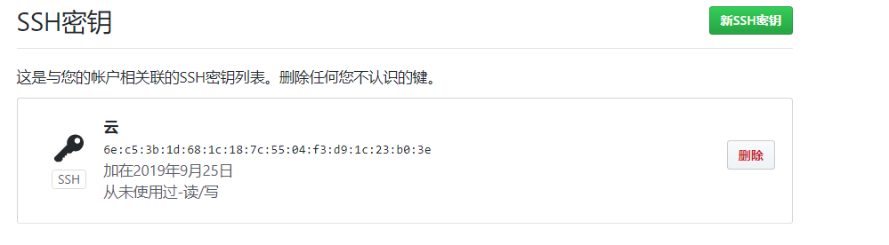

# 云计算开发基础

## 实验一:购买腾讯云服务器并登录

### 购买腾讯云服务器 

 在腾讯云学生计划网站购买腾讯云服务器 https://cloud.tencent.com/

### 使用Web Shell登录已购买的云服务器实例 

登入Xsell官网http://www.xshellcn.com/xiazai.html下载

新建会话 

主机输入云服务器IP地址

输入密码登入成功

## 实验二：创建GitHub项目并在本地同步

### 注册GitHub账号：https://github.com/

登入https://github.com/创建账号

前往https://git-scm.com/downloads下载Git

创建SSH Key并添加

测试SSH Key是否配置成功

配置用户名和邮箱

访问GitHub网站并新建代码仓库

创建本地代码仓库

无法拉取数据手动添加

继续同步

成功同步

## 本地安装VMware Workstation和CentOS操作系统

