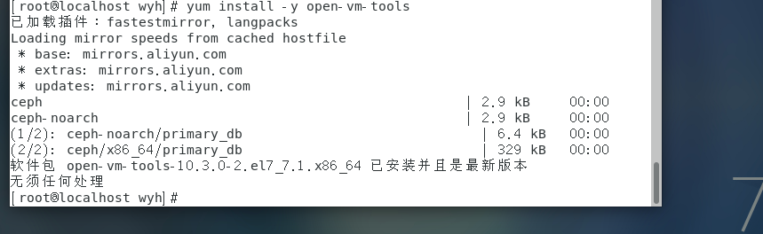

# Ceph安装和实践

## 安装虚拟机

**安装带有图形界面的centos**


**添加用户配置权限**

```
useradd -d /home/cephuser -m cephuser

passwd cephuser

echo "cephuser ALL = (root) NOPASSWD:ALL" | sudo tee /etc/sudoers.d/cephuser

chmod 0440 /etc/sudoers.d/cephuser

sed -i s'/Defaults requiretty/#Defaults requiretty'/g /etc/sudoers
```


**安装设置open-vm-tools服务自动启动**

```
yum install -y open-vm-tools

systemctl enable vmtoolsd

systemctl start vmtoolsd
```


**安装配置ntp服务**

```
yum install -y ntp ntpdate ntp-doc

ntpdate 0.us.pool.ntp.org

hwclock --systohc

systemctl enable ntpd.service

systemctl start ntpd.service
```


**禁用SELINUX添加ceph仓库：**

```
sed -i 's/SELINUX=enforcing/SELINUX=disabled/g' /etc/selinux/config
sudo vi /etc/yum.repos.d/ceph.repo
```

**文件内容**

```
[ceph]

name=Ceph packages for $basearch

baseurl=http://mirrors.163.com/ceph/rpm-jewel/el7/$basearch

enabled=1

gpgcheck=0

priority=1

type=rpm-md

gpgkey=http://mirrors.163.com/ceph/keys/release.asc

 

[ceph-noarch]

name=Ceph noarch packages

baseurl=http://mirrors.163.com/ceph/rpm-jewel/el7/noarch

enabled=1

gpgcheck=0

priority=1

type=rpm-md

gpgkey=http://mirrors.163.com/ceph/keys/release.asc

[ceph-source]

name=Ceph source packages

baseurl=http://mirrors.163.com/ceph/rpm-jewel/el7/SRPMS

enabled=0

gpgcheck=0

type=rpm-md

gpgkey=http://mirrors.163.com/ceph/keys/release.asc

priority=1
```

**防火墙设置**

```
systemctl start firewalld
systemctl enable firewalld
```


**因为需要所有节点在虚拟机上运行**

```
yum install -y open-vm-tools
```



以上节点配置完成

**克隆三台节点**

Mon1  osd1 osd2

**主控节点防火墙**

```
sudo firewall-cmd --zone=public --add-port=80/tcp --permanent

sudo firewall-cmd --zone=public --add-port=2003/tcp --permanent

sudo firewall-cmd --zone=public --add-port=4505-4506/tcp --permanent

sudo firewall-cmd --reload
```


**monistor节点防火墙**

```
sudo firewall-cmd --zone=public --add-port=6789/tcp --permanent

sudo firewall-cmd --reload
```


**普通节点防火墙**

```
sudo firewall-cmd --zone=public --add-port=6800-7300/tcp --permanent

sudo firewall-cmd --reload  
```


## 配置SSH服务器

**主控节点**

```
vi /etc/hosts
```

**设置免密登录ssh**

```
su - cephuser
```

**生成密钥**

```
ssh-keygen
```


```
vi ~/.ssh/config
```

**\#添加如下配置**

Host ceph-admin

 Hostname ceph-admin

 User cephuser

Host mon1

 Hostname mon1

 User cephuser

Host osd1

 Hostname osd1

 User cephuser

Host osd2

 Hostname osd2

 User cephuser

**更改配置文件的权限**

```
chmod 644 ~/.ssh/config

ssh-keyscan osd1 osd2 mon1 >> ~/.ssh/known_hosts
```


**使用ssh-copy-id命令将SSH密钥添加到所有节点。**

```
ssh-copy-id ceph-admin

ssh-copy-id mon1

ssh-copy-id osd1

ssh-copy-id osd2
```

**测试ssh**


## ceph-deploy安装

```
sudo yum update && sudo yum install ceph-deploy
```


##  创建集群

```
mkdir cluster && cd cluster

ceph-deploy new mon1

vi ceph.conf
```

## 在所有节点上安装Ceph

```
ceph-deploy install ceph-admin mon1 osd1 osd2
```


**在mon1节点执行**

```
hostnamectl set-hostname mon1
```

**主控节点执行**

```
ceph-deploy mon create-initial

ceph-deploy gatherkeys mon1
```


**osd节点执行**

```
sudo mkdir /var/local/osd

sudo chown ceph: /var/local/osd
```

**主控节点执行**

将管理密钥部署到所有关联的节点。

```
ceph-deploy osd prepare osd1:/var/local/osd osd2:/var/local/osd
ceph-deploy osd activate osd1:/var/local/osd osd2:/var/local/osd
ceph-deploy admin ceph-admin mon1 osd1 osd2
```


## 检查集群状态

**从ceph-admin节点登录到ceph监视服务器“ mon1 ”， 运行以下命令以检查集群运行状况。**

```
ssh mon1

sudo ceph health
```

**检查集群状态**

```
sudo ceph -s
```

